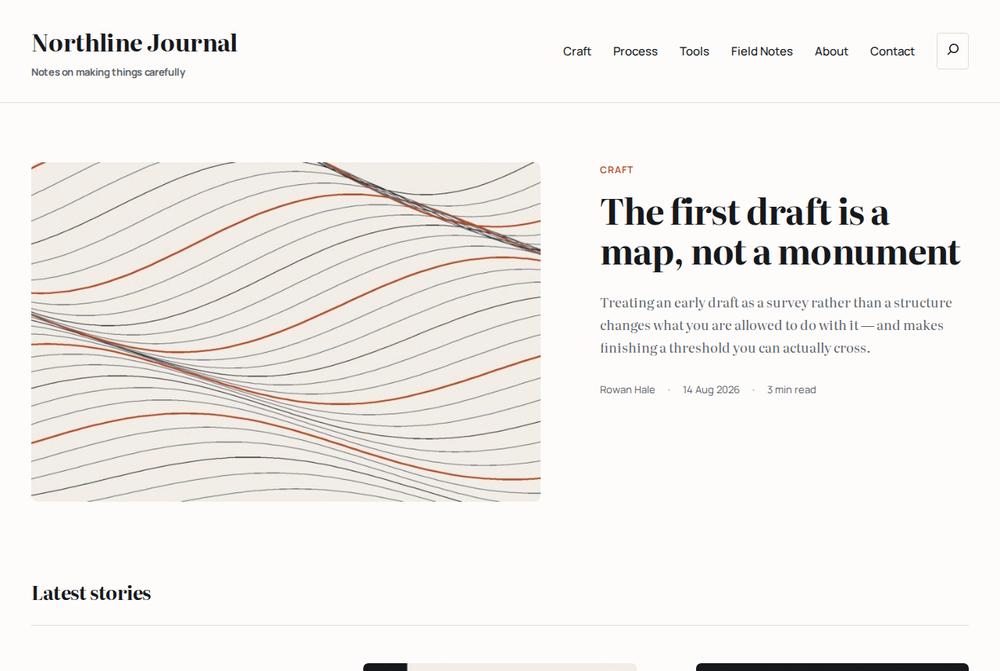

# Northline — WordPress blog theme + demo content

A working blog build for WordPress: an editorial block theme, the plugin set a blog
actually needs, and eight real articles with original cover art so the layout can be
judged on real content rather than lorem ipsum.

Built and tested on **WordPress 7.0.4 / PHP 8.3**.



---

## What is in here

| Path | What it is |
| --- | --- |
| `theme/northline/` | The theme. A child theme of Twenty Twenty-Five — block templates, `theme.json` design tokens, self-hosted fonts. |
| `tools/seed-content.php` | One WP-CLI script that creates the categories, posts, pages, menu, forms and settings. Re-runnable. |
| `tools/content/*.html` | The eight articles, as block markup. Edit these and re-run the seeder. |
| `tools/media/*.jpg` | Cover images. Generated, original, no stock licence attached. |
| `tools/generate-covers.py` | The script that draws the covers, if you want different ones. |
| `tools/demo-local-avatars.php` | Demo-only: serves local initials avatars instead of Gravatar. **Do not install on the live site.** |

---

## Install

### 1. The theme

Either upload a zip through **Appearance → Themes → Add New → Upload Theme**:

```sh
./make-theme-zip.sh          # writes dist/northline.zip
```

…or copy the folder straight into the site:

```sh
cp -r theme/northline /path/to/wordpress/wp-content/themes/
wp theme activate northline
```

Twenty Twenty-Five must stay installed — it is the parent theme. It ships with
WordPress, so on a normal install there is nothing to do.

### 2. The plugins

```sh
wp plugin install wp-seopress contact-form-7 wp-super-cache --activate
wp plugin activate akismet
```

| Plugin | Why |
| --- | --- |
| **SEOPress** | Titles, meta descriptions, Open Graph, XML sitemap. Free, no account required. |
| **Contact Form 7** | The contact form and the newsletter sign-up. |
| **WP Super Cache** | Page caching. Turn it on under Settings → WP Super Cache once the site is live. |
| **Akismet** | Comment spam. Needs a free API key. |

### 3. The demo content (optional)

Only if you want the eight sample articles. Skip this on a site that already has posts.

```sh
cd /path/to/wordpress
wp eval-file /path/to/this-repo/tools/seed-content.php
```

It is safe to run twice — everything is matched by slug and updated rather than
duplicated. It creates:

- 4 categories (Craft, Process, Tools, Field Notes) with descriptions
- 8 published posts, each with a featured image, excerpt, tags and a back-dated
  publish date so the archive looks lived-in
- 3 comments on the two newest posts
- 3 pages (About, Contact, Privacy)
- the header navigation
- two Contact Form 7 forms, "Contact" and "Newsletter"
- permalink, timezone, date-format, comment and SEOPress defaults

To remove it again later, delete the posts and pages from the admin as normal.

---

## The theme

### Templates

| Template | Layout |
| --- | --- |
| `home.html` | Lead story (image + headline + deck + byline), then a 3-column card grid with pagination, then the newsletter band. |
| `single.html` | Category eyebrow, headline, deck, byline rule, wide featured image, 720px reading measure, tag pills, author box, prev/next, "Keep reading", comments. |
| `archive.html` | Category/tag header with the term description, then the card grid. |
| `search.html` | Same grid, with the query echoed and a second search box. |
| `page.html` | Plain page. |
| `page-wide.html` | Selectable page template with no title and the full 1200px width. |
| `404.html` | Search box and a way back. |

### Design tokens

All in `theme.json`, so they are editable from **Appearance → Editor → Styles**
without touching code.

- **Type** — Literata for headlines and body, Manrope for UI and metadata. Both
  self-hosted from the theme folder; no Google Fonts request, so no third-party
  connection on page load.
- **Colour** — paper `#FDFCFA`, sand `#F2EEE7`, ink `#16181C`, muted ink `#5E636C`,
  terracotta `#B14A26`, deep navy `#1F3A5F`, rule `#E2DCD2`.
- **Measure** — 720px for reading, 1200px for the wide grid.

### Things worth knowing

**Reading time** is a block binding, not a plugin. Any paragraph can print it:

```html
<!-- wp:paragraph {"metadata":{"bindings":{"content":{"source":"northline/reading-time"}}}} -->
<p>min read</p>
<!-- /wp:paragraph -->
```

It counts words at 220 wpm and rounds to whole minutes, minimum 1.

**"Keep reading"** prefers posts from the same category and falls back to recent
posts when that category cannot fill the row. The current post is always excluded.
See `northline_related_query_vars()`.

**Shortcodes in templates** — WordPress renders block templates through `do_blocks()`
without ever running `the_content()`, so a shortcode block placed in a template
prints its own source. `northline_render_shortcode_block()` expands it.

**The newsletter band** looks for a Contact Form 7 form titled *Newsletter*. If the
plugin is inactive or the form is missing it falls back to a note telling you where
to paste a Mailchimp/ConvertKit embed instead.

**The contact form** is placed with `[northline_contact_form]` rather than a
hard-coded CF7 ID, so the page keeps working if the form is ever recreated.

---

## Local development

There is no build step — the theme is plain CSS, `theme.json` and block markup.
Edit and reload.

To regenerate the cover images:

```sh
python3 tools/generate-covers.py     # needs Pillow
```

---

## Licence

Theme code: GPL-2.0-or-later, matching WordPress.
Fonts: Literata and Manrope, both SIL Open Font License 1.1, taken from the
Twenty Twenty-Five bundle.
Cover images: generated by `tools/generate-covers.py` — original work, use freely.
